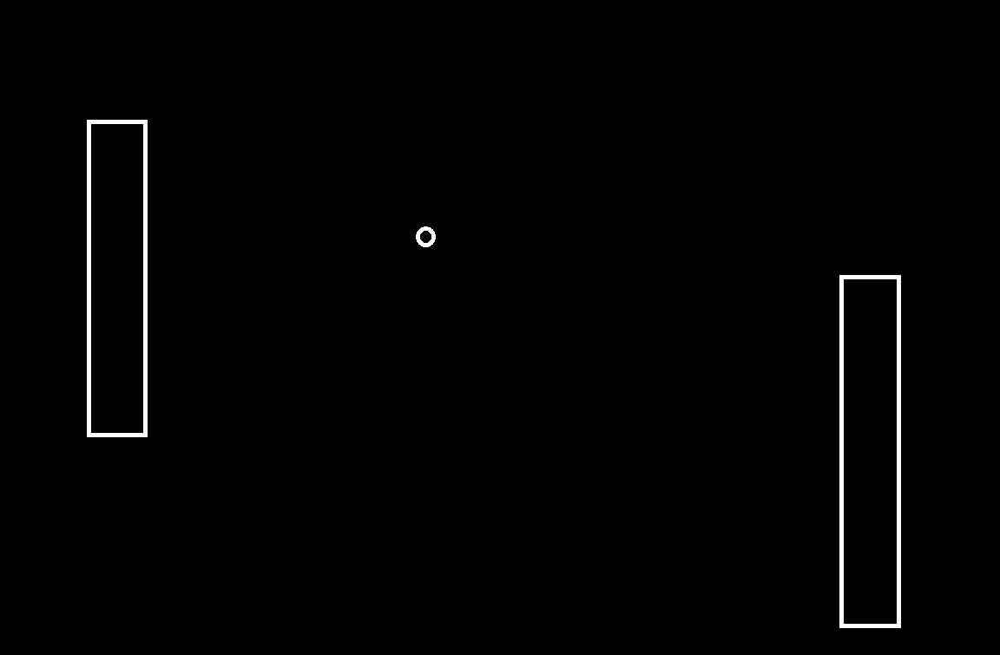

:warning: Everything between << >> needs to be replaced (remove << >> after replacing)

# Pong 
## CS110 B1 Final Project Semester 1, 2024

## Team Members

Michael Truong

***

## Project Description

A game of pong where opponents try to score in each other's goals. There will be a ball and controllable walls. When the ball hits a wall, the ball will go the opposite direction

***    

## GUI Design

### Initial Design

### Final Design

## Program Design

### Features

1. Start Menu
2. Game score
3. Controllable walls
4. Balls that bounce 
5. Ability to add more balls

### Classes

- << You should have a list of each of your classes with a description >>

## ATP

| Step                 |Procedure             |Expected Results                   |
|----------------------|:--------------------:|----------------------------------:|
|  1                   | Run Counter Program  |GUI window appears with count = 0  |
|  2                   | click count button   | display changes to count = 1      |
etc...
